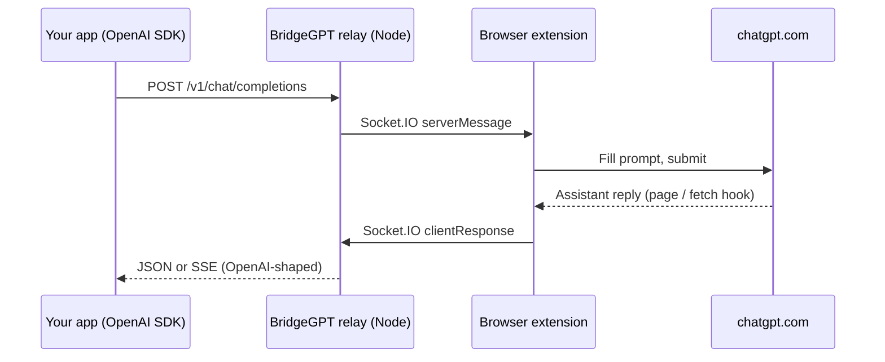

<div align="center">
  
  <h1>BridgeGPT</h1>
  <p><strong>Self-hosted relay: use your ChatGPT <em>web</em> session through an OpenAI-compatible HTTP API</strong></p>
  <p>Browser extension + small Node server. You control the relay and the browser—no dependency on a third-party hosted bridge.</p>
</div>

**Language:** English | [简体中文](README.zh-CN.md)

---

## Table of contents

- [What it does](#what-it-does)
- [How it works](#how-it-works)
- [Features](#features)
- [Requirements](#requirements)
- [Quick start](#quick-start)
- [Deploying your relay](#deploying-your-relay)
- [Configuration](#configuration)
- [HTTP API](#http-api)
- [npm scripts](#npm-scripts)
- [Production](#production)
- [Security](#security)
- [Limitations](#limitations)
- [Troubleshooting](#troubleshooting)
- [Repository layout](#repository-layout)
- [Acknowledgements](#acknowledgements)
- [License](#license)

---

## What it does

BridgeGPT lets client applications call **`/v1/chat/completions`** (and related OpenAI-style routes) against a relay you run. The relay forwards work to a **Chrome (or Firefox) extension** that drives **https://chatgpt.com** in a normal logged-in tab. Replies are turned into standard JSON or SSE, so existing OpenAI SDKs can often work with only `base_url` and `api_key` changes.

**This is not** the official OpenAI API, **not** an official ChatGPT product, and **not** suitable for bypassing ChatGPT terms of use. Run it only for personal or permitted automation on accounts you control.

---

## How it works



1. The relay accepts HTTP requests authenticated with **`api_key`**: the same secret the extension shows in Settings (internally the server maps it to your browser’s Socket.IO session).
2. The extension opens or reuses a **chatgpt.com** tab, injects the user message, and captures the assistant text.
3. The relay wraps that text as **`chat.completion`** or **streaming `chat.completion.chunk`** events.

---

## Features

- **OpenAI-compatible** — `POST /v1/chat/completions`, `GET /v1/models`, optional **SSE streaming** (simulated chunks after the full reply is captured).
- **Self-hosted relay** — Express + Socket.IO; default port **3456**.
- **Configurable extension** — Build-time **`VITE_API_BASE_URL`** points the extension at your relay (must end with `/`).
- **Keep-alive option** — Extension can periodically retry the WebSocket if disconnected (see Settings).
- **Relay home** — `GET /` shows a welcome page without `api_key`. With `?api_key=<your key from Settings>` you get a **ChatGPT-style web chat** (uses `POST /v1/chat/completions` with streaming). Optional `&message=…` pre-sends the first user turn. `?format=json` (or `Accept: application/json`) returns machine-readable status and a sample `chatUrl`.

---

## Requirements

| Component | Version / notes |
|-----------|-----------------|
| Node.js | **≥ 18** |
| npm | Workspaces-enabled install at repo root |
| Browser | **Chrome** or **Firefox** (Manifest V3) |
| ChatGPT | Active **web** session on **https://chatgpt.com** |

---

## Quick start

### 1. Clone and install

```bash
git clone https://github.com/ocmuuu/BridgeGPT.git
cd BridgeGPT
npm install
```

### 2. Start the relay

```bash
npm run dev:server
```

By default the relay listens on **http://localhost:3456**. Verify with:

```bash
curl -sS http://127.0.0.1:3456/health
# {"ok":true}
```

### 3. Build and load the extension

**Chrome (watch mode):**

```bash
npm run dev:chrome
```

**One-off production build:**

```bash
npm run build:chrome
```

Then open **chrome://extensions** → enable **Developer mode** → **Load unpacked** → choose **`extension/dist_chrome/`**.

**Firefox:** use `npm run dev:firefox` or `npm run build:firefox` and load from **`extension/dist_firefox/`** via `about:debugging`.

### 4. Connect and get credentials

1. Open the extension **Settings** (or the page opened on first install).
2. Click **Connect** so the extension joins the relay over WebSocket.
3. Keep **chatgpt.com** signed in; the relay uses that tab to answer API calls.
4. Copy **`base_url`** (`…/v1`) and **`api_key`** (e.g. `sk-bridgegpt-…`) from the settings panel.

### 5. Call the API (Python example)

```python
from openai import OpenAI

client = OpenAI(
    base_url="http://localhost:3456/v1",
    api_key="YOUR_API_KEY_FROM_EXTENSION",
)

r = client.chat.completions.create(
    model="gpt-5",
    messages=[{"role": "user", "content": "Hello"}],
)
print(r.choices[0].message.content)
```

---

## Deploying your relay

To run the relay on your own host (VPS, homelab, etc.):

1. **Install** — Clone the repo, run `npm install` at the workspace root (same as [Quick start](#quick-start)).
2. **Build** — `npm run build:server` produces `server/dist/`.
3. **Run** — `npm run start -w @bridgegpt/server` (or `node server/dist/index.js` from a process manager). Set **`PORT`** (default `3456`) and optionally **`RELAY_REQUEST_TIMEOUT_MS`**.
4. **HTTPS** — Put **Caddy**, **nginx**, or another reverse proxy in front with TLS when clients are not on localhost; enable **WebSocket** pass-through for Socket.IO.
5. **Extension** — Build the extension with **`VITE_API_BASE_URL`** set to your public relay URL (trailing `/`), then install that build in the browser that stays logged in to ChatGPT.

See [Production](#production) and [Security](#security) for hardening notes.

---

## Configuration

### Relay (environment)

| Variable | Default | Description |
|----------|---------|-------------|
| `PORT` | `3456` | HTTP listen port |
| `RELAY_REQUEST_TIMEOUT_MS` | `120000` | Max wait for the extension to return a completion |

### Extension (build-time)

| Variable | Description |
|----------|-------------|
| `VITE_API_BASE_URL` | Relay origin **with trailing slash**, e.g. `https://relay.example.com/`. If unset, defaults to `http://127.0.0.1:3456/`. |

Example:

```bash
VITE_API_BASE_URL=https://relay.example.com/ npm run build:chrome
```

### Authentication to the relay

Standard routes expect your **api_key** (the value from the extension Settings) as:

- **`Authorization: Bearer <api_key>`**, or  
- **`x-api-key` / `openai-api-key` / `api-key`** header  

Legacy routes under **`/app/<api_key>/v1/...`** embed the same value in the path instead of headers.

---

## HTTP API

| Method | Path | Auth | Description |
|--------|------|------|-------------|
| GET | `/health` | No | Liveness: `{ "ok": true }` |
| GET | `/connect/:api_key?socketId=...` | No | Called by the extension after Socket.IO connect; path segment is the same **api_key** as for HTTP |
| GET | `/v1/models` | Bearer / API key | Lists `gpt-5` / `gpt-5-mini` (labels only; the web UI picks the real model) |
| GET | `/v1/models/:modelId` | Bearer / API key | Model metadata |
| POST | `/v1/chat/completions` | Bearer / API key | Chat completions; body may include `"stream": true` for SSE |
| GET | `/` | Query `api_key` or Bearer | Without key: welcome HTML. With key: browser chat UI; optional `message` = first user turn. JSON if `format=json` or `Accept: application/json` |
| * | `/app/:api_key/v1/...` | Path **api_key** | Same as `/v1/...` for older clients |

**Streaming:** `stream: true` returns **`text/event-stream`** with OpenAI-style **`data:`** lines and a final **`data: [DONE]`**. The extension still returns one full message; the relay **splits** it into chunks for SDK compatibility.

**Not implemented:** embeddings, audio, images, Assistants API, Realtime API, etc. Those would need separate services or a different architecture.

---

## npm scripts

Run from the **repository root**:

| Script | Action |
|--------|--------|
| `npm run dev:server` | Relay dev server (`tsx watch`) |
| `npm run build:server` | Compile relay to `server/dist/` |
| `npm run dev:chrome` | Extension dev (watch) for Chrome |
| `npm run dev:firefox` | Extension dev (watch) for Firefox |
| `npm run build:chrome` | Production extension build → `extension/dist_chrome/` |
| `npm run build:firefox` | Production extension build → `extension/dist_firefox/` |

**Production relay process** (after build):

```bash
npm run build:server
npm run start -w @bridgegpt/server
# runs node server/dist/index.js
```

---

## Production

- Put the relay behind **HTTPS** (reverse proxy) if clients are not on localhost.
- Ensure the extension is built with **`VITE_API_BASE_URL`** pointing at that HTTPS origin (with trailing `/`).
- **Firewall:** only expose the relay to networks you trust; treat **`api_key` like a password**—regenerate it in extension Settings if it leaks.
- **Socket.IO** uses WebSockets; proxies must support WebSocket upgrade.

---

## Security

- Traffic includes **prompts and model output**; treat the relay host and **api_key** as **sensitive**.
- Do **not** commit real **api_key** values, tokens, or production URLs into public repositories.
- Harden the machine running the browser extension (anyone with API access can drive your ChatGPT tab subject to site UI).

---

## Limitations

- Depends on **ChatGPT web UI** DOM and network behavior; site updates can break the extension until it is updated.
- **No true token-by-token** streaming from the web UI; streaming is **simulated** after the full reply is captured.
- **Model names** in the API are labels; the actual model is whatever the web session uses.
- Using this stack must comply with **OpenAI / ChatGPT terms** and applicable law.

---

## Troubleshooting

| Symptom | Things to check |
|---------|------------------|
| Extension **Disconnected** | Relay running? Correct `VITE_API_BASE_URL`? Firewall / HTTPS mismatch? Try **Connect** again; enable **Keep alive** in settings if you want auto-retry. |
| HTTP **503** “No extension connected” | Extension not connected or **api_key** mismatch. Open Settings and confirm **Connect** and that the client uses the same **api_key**. |
| HTTP **504** / timeout | ChatGPT tab closed or slow; increase `RELAY_REQUEST_TIMEOUT_MS`; ensure **chatgpt.com** finished loading. |
| Empty or wrong replies | UI selectors may need an update after a ChatGPT redesign; check the browser console on the ChatGPT tab. |
| CORS from a web app | Relay enables permissive CORS for API use; for cookie-based browsers, prefer **server-side** calls to the relay. |

---

## Repository layout

```
bridgegpt/
├── extension/                 # Vite + CRXJS (Chrome / Firefox)
│   ├── src/pages/background/  # Service worker, Socket.IO client
│   ├── src/pages/content/     # chatgpt.com content scripts + loader hook
│   ├── src/pages/settings/    # Settings UI (connect, API URL, keep-alive)
│   ├── manifest.json
│   └── package.json           # workspace: bridgegpt-extension
├── server/                    # Relay
│   ├── src/
│   │   ├── index.ts           # HTTP + Socket.IO bootstrap
│   │   ├── extensionRelay.ts  # Pending queue, /connect route
│   │   └── openaiApi.ts       # OpenAI-shaped routes + SSE
│   └── package.json           # workspace: @bridgegpt/server
├── package.json               # Workspace root
└── README.md
```

More detail for the extension-only subtree: [`extension/README.md`](extension/README.md).

---

## Acknowledgements

This project was **inspired by ideas from the open-source [ApiBeam](https://github.com/NiteshSingh17/apibeam) project**. If upstream public infrastructure is unavailable, this repo is meant to be **fully self-hosted**. Mentioning ApiBeam in your own docs or release notes is welcome but optional.

Stack highlights: [Vite](https://vitejs.dev/), [React](https://react.dev/), [Tailwind CSS](https://tailwindcss.com/), [Express](https://expressjs.com/), [Socket.IO](https://socket.io/).

---

## License

[MIT](LICENSE) (if `LICENSE` is missing, see the `license` field in `package.json`).

---

## Links

- [OpenAI Python SDK](https://github.com/openai/openai-python)
- [OpenAI Node SDK](https://github.com/openai/openai-node)
- [Chrome Extensions (MV3)](https://developer.chrome.com/docs/extensions/mv3/)
- [Socket.IO](https://socket.io/docs/)
