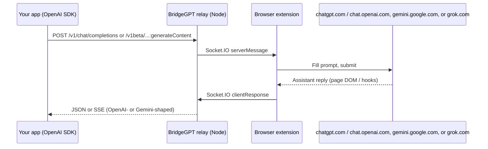

<div align="center">
  
  <h1>BridgeGPT</h1>
  <p><strong>Self-hosted relay: drive <em>ChatGPT</em>, <em>Google Gemini</em>, or <em>Grok</em> in the browser through OpenAI- and Gemini-style HTTP APIs</strong></p>
  <p>Browser extension + small Node server. You control the relay and the browser—no dependency on a third-party hosted bridge.</p>
</div>

**Language:** English | [简体中文](README.zh-CN.md)

---

## Table of contents

- [What it does](#what-it-does)
- [How it works](#how-it-works)
- [Features](#features)
- [Requirements](#requirements)
- [Quick start](#quick-start)
- [Verifying your setup](#verifying-your-setup)
- [Deploying your relay](#deploying-your-relay)
- [Server deployment (full guide)](docs/SERVER_DEPLOY.md)
- [Configuration](#configuration)
- [HTTP API](#http-api)
- [npm scripts](#npm-scripts)
- [Production](#production)
- [Security](#security)
- [Limitations](#limitations)
- [Troubleshooting](#troubleshooting)
- [Repository layout](#repository-layout)
- [Acknowledgements](#acknowledgements)
- [License](#license)

---

## What it does

BridgeGPT lets client applications call **`/v1/chat/completions`** (OpenAI-style) and **`/v1beta/models/...:generateContent`** (Gemini-style) against a relay you run. The relay forwards work to a **Chrome (or Firefox) extension** that drives **https://chatgpt.com** / **https://chat.openai.com**, **https://gemini.google.com**, and/or **https://grok.com** in normal logged-in tabs. Replies are turned into JSON or SSE so existing **OpenAI** or **Gemini** client patterns can often work with only `base_url` and `api_key` changes.

**This is not** the official OpenAI, Google Generative Language, or xAI API, **not** an official ChatGPT, Gemini, or Grok product, and **not** suitable for bypassing provider terms of use. Run it only for personal or permitted automation on accounts you control.

---

## How it works



1. The relay accepts HTTP requests authenticated with **`api_key`**: the same secret the extension shows in Settings (internally the server maps it to your browser’s Socket.IO session).
2. The extension opens or reuses a **chatgpt.com** / **chat.openai.com**, **gemini.google.com**, and/or **grok.com** tab (depending on the route and headers), injects the user message, and captures the assistant text from the page.
3. The relay wraps that text as **`chat.completion`** / **`chat.completion.chunk`** or a **Gemini `generateContent`-style** JSON body.

---

## Features

- **OpenAI-compatible** — `POST /v1/chat/completions`, `GET /v1/models`, optional **SSE streaming** (simulated chunks after the full reply is captured). Use header **`X-Bridge-Provider: gemini`** to target **gemini.google.com**, or **`X-Bridge-Provider: grok`** to target **grok.com**, instead of ChatGPT for the same route.
- **Gemini API–shaped routes** — `GET /v1beta/models`, `POST /v1beta/models/<id>:generateContent` (and `:streamGenerateContent`), same **Bearer `api_key`** as other relay routes. Responses are a **minimal subset** of the real Google API (text + usage estimates); thread context stays in the browser tab.
- **Self-hosted relay** — Express + Socket.IO; default port **3456**.
- **Configurable extension** — Build-time **`VITE_API_BASE_URL`** points the extension at your relay (must end with `/`).
- **Keep-alive option** — Extension can periodically retry the WebSocket if disconnected (see Settings).
- **Relay home** — `GET /` shows a welcome page without `api_key`. With `?api_key=<your key from Settings>` you get an in-browser chat UI (OpenAI, Gemini, or Grok backend; use **`&backend=gemini`** or **`&backend=grok`**). Optional `&message=…` pre-sends the first user turn. `?format=json` (or `Accept: application/json`) returns machine-readable status and a sample `chatUrl`.
- **Unified provider pipeline** — ChatGPT, Gemini, and Grok share the same high-level phases in the extension (receive → resolve composer → fill → submit → wait/capture → emit). ChatGPT captures assistant text from **SSE** in the page; Gemini and Grok use **DOM polling** with site-specific heuristics.
- **Relay discovery JSON** — `GET /extension/version` returns expected **extension** and **relay** semver (used by the extension for update hints). `GET /extension/provider-phase-config` returns the phase list plus a structured **`providerExecutionProfile`** (timeouts, `postMessage` identities, primary selectors — not executable code). Developer-only mirror of bundled TypeScript: add **`?include=typescript_sources`**.

---

## Requirements

| Component | Version / notes |
|-----------|-----------------|
| Node.js | **≥ 18** |
| npm | Workspaces-enabled install at repo root |
| Browser | **Chrome** or **Firefox** (Manifest V3) |
| ChatGPT | For ChatGPT API routes: active **web** session on **https://chatgpt.com** or **https://chat.openai.com** (both are matched by the extension; other hostnames such as **www** only work if you add them to `extension/manifest.json`) |
| Gemini | For Gemini routes or `X-Bridge-Provider: gemini`: active session on **https://gemini.google.com** |
| Grok | For `X-Bridge-Provider: grok` on `/v1/chat/completions` or relay UI `backend=grok`: active session on **https://grok.com** |

---

## Quick start

### 1. Clone and install

```bash
git clone https://github.com/ocmuuu/BridgeGPT.git
cd BridgeGPT
npm install
```

### 2. Start the relay

```bash
npm run dev:server
```

By default the relay listens on **http://localhost:3456**. Verify with:

```bash
curl -sS http://127.0.0.1:3456/health
# {"ok":true}
```

### 3. Install the Chrome extension

Pick **either** a pre-built zip from GitHub Releases **or** a local build from source.

#### A) GitHub Releases (simplest)

1. Open **[BridgeGPT Releases](https://github.com/ocmuuu/BridgeGPT/releases)** and download **`bridgegpt-chrome-<tag>.zip`** for the version you want (the workflow attaches one zip per release tag, e.g. `bridgegpt-chrome-v1.8.0.zip`).
2. In Chrome, go to **`chrome://extensions`**.
3. Turn on **Developer mode** (top right).
4. **Drag and drop** the downloaded zip onto the Extensions page to install.  
   If your Chrome build does not accept a zip this way, unzip the archive and use **Load unpacked** → select the **folder that contains `manifest.json`** (the unzipped contents of `dist_chrome`).

To **update**, download the newer release zip and repeat; Chrome will replace the extension when you drop the new package or reload the unpacked folder after replacing files.

#### B) Build from source (developers)

**Watch mode:**

```bash
npm run dev:chrome
```

**Production output** (`extension/dist_chrome/`):

```bash
npm run build:chrome
```

Then **chrome://extensions** → **Developer mode** → **Load unpacked** → select **`extension/dist_chrome/`**.

**Firefox:** `npm run dev:firefox` or `npm run build:firefox`, then load **`extension/dist_firefox/`** via **about:debugging** → *This Firefox* → *Load Temporary Add-on*.

Release automation for Chrome zips: [.github/workflows/release-chrome-extension.yml](.github/workflows/release-chrome-extension.yml) (triggered by pushing a **`v*`** tag).

### 4. Connect and get credentials

1. Open the extension **Settings** (or the page opened on first install).
2. Click **Connect** so the extension joins the relay over WebSocket.
3. Keep **chatgpt.com** / **chat.openai.com**, **gemini.google.com**, and/or **grok.com** signed in (whichever backends you use); the extension reuses matching tabs when possible.
4. Copy **`base_url`** (`…/v1`) and **`api_key`** (e.g. `sk-bridgegpt-…`) from the settings panel.

### 5. Call the API (Python example)

```python
from openai import OpenAI

client = OpenAI(
    base_url="http://localhost:3456/v1",
    api_key="YOUR_API_KEY_FROM_EXTENSION",
)

r = client.chat.completions.create(
    model="gpt-5",
    messages=[{"role": "user", "content": "Hello"}],
)
print(r.choices[0].message.content)
```

---

## Verifying your setup

After the relay is running, the extension is **Connect**ed, and the right web UI tab is open, you can sanity-check both **HTTP clients** and the **relay web chat**.

### Health

```bash
curl -sS http://127.0.0.1:3456/health
# {"ok":true}
```

### ChatGPT path (`curl`)

Replace `YOUR_API_KEY` with the value from extension Settings.

```bash
curl -sS http://127.0.0.1:3456/v1/chat/completions \
  -H "Authorization: Bearer YOUR_API_KEY" \
  -H "Content-Type: application/json" \
  -d '{"model":"gpt-5","messages":[{"role":"user","content":"Say hi in one sentence."}],"stream":false}'
```

### Grok path (`curl`, OpenAI-compatible route)

Same **`api_key`** as ChatGPT; add **`X-Bridge-Provider: grok`** and keep a **grok.com** tab available.

```bash
curl -sS http://127.0.0.1:3456/v1/chat/completions \
  -H "Authorization: Bearer YOUR_API_KEY" \
  -H "Content-Type: application/json" \
  -H "X-Bridge-Provider: grok" \
  -d '{"model":"grok-4.2","messages":[{"role":"user","content":"Say hi in one sentence."}],"stream":false}'
```

Model names such as **`grok-4.2`** are **placeholders**; the live session follows whatever you use on **grok.com**.

### Gemini path (`curl`)

Uses the same **`api_key`**; ensure a **gemini.google.com** tab is available (extension may open one on first use).

```bash
curl -sS "http://127.0.0.1:3456/v1beta/models/gemini-3.1-flash:generateContent" \
  -H "Authorization: Bearer YOUR_API_KEY" \
  -H "Content-Type: application/json" \
  -d '{"contents":[{"role":"user","parts":[{"text":"Hello"}]}]}'
```

Model IDs such as **`gemini-3.1-flash`** are **placeholders** for clients; the answer reflects whatever model/session the open Gemini tab is using.

### Relay web UI

Open `http://127.0.0.1:3456/?api_key=YOUR_API_KEY` in a browser. Use the on-page controls to pick **OpenAI (ChatGPT)**, **Gemini**, or **Grok** backend and send messages; this exercises the same HTTP stack as `curl` without extra tools.

---

## Deploying your relay

**Full step-by-step guide (build, PM2, systemd, nginx, TLS, upgrades): [docs/SERVER_DEPLOY.md](docs/SERVER_DEPLOY.md)** · [简体中文](docs/SERVER_DEPLOY.zh-CN.md)

To run the relay on your own host (VPS, homelab, etc.):

1. **Install** — Clone the repo, run `npm install` at the workspace root (same as [Quick start](#quick-start)).
2. **Build** — `npm run build:server` produces `server/dist/`.
3. **Run** — `npm run start -w @bridgegpt/server` (or `node server/dist/index.js` from a process manager). Set **`PORT`** (default `3456`) and optionally **`RELAY_REQUEST_TIMEOUT_MS`**.
4. **HTTPS** — Put **Caddy**, **nginx**, or another reverse proxy in front with TLS when clients are not on localhost; enable **WebSocket** pass-through for Socket.IO.
5. **Extension** — Build the extension with **`VITE_API_BASE_URL`** set to your public relay URL (trailing `/`), then install that build in the browser that stays logged in to **ChatGPT (chatgpt.com or chat.openai.com), Gemini, and/or Grok** (web), as you use them.

See [Production](#production) and [Security](#security) for hardening notes. For a complete production checklist, use **[docs/SERVER_DEPLOY.md](docs/SERVER_DEPLOY.md)**.

---

## Configuration

### Relay (environment)

| Variable | Default | Description |
|----------|---------|-------------|
| `PORT` | `3456` | HTTP listen port |
| `RELAY_REQUEST_TIMEOUT_MS` | `150000` | Max wait (ms) for the extension to return a completion (tab cold-start + long web replies) |

### Extension (build-time)

| Variable | Description |
|----------|-------------|
| `VITE_API_BASE_URL` | Relay origin **with trailing slash**, e.g. `https://relay.example.com/`. If unset, defaults to `http://127.0.0.1:3456/`. |

Example:

```bash
VITE_API_BASE_URL=https://relay.example.com/ npm run build:chrome
```

### Authentication to the relay

Standard routes expect your **api_key** (the value from the extension Settings) as:

- **`Authorization: Bearer <api_key>`**, or  
- **`x-api-key` / `openai-api-key` / `api-key`** header  

Legacy routes under **`/app/<api_key>/v1/...`** embed the same value in the path instead of headers.

---

## HTTP API

| Method | Path | Auth | Description |
|--------|------|------|-------------|
| GET | `/health` | No | Liveness: `{ "ok": true }` |
| GET | `/extension/version` | No | `{ "extension": "<semver>", "relay": "<semver>" }` — expected extension build vs server package; extension uses this for update hints |
| GET | `/extension/provider-phase-config` | No | Phase model, per-provider strategy, embedded **`providerExecutionProfile`** (structured defaults). Optional **`?include=typescript_sources`** adds large **`providerStepDefaults`** (TypeScript sources) |
| GET | `/connect/:api_key?socketId=...` | No | Called by the extension after Socket.IO connect; path segment is the same **api_key** as for HTTP |
| GET | `/v1/models` | Bearer / API key | Lists `gpt-5` / `gpt-5-mini` (labels only; the web UI picks the real model) |
| GET | `/v1/models/:modelId` | Bearer / API key | Model metadata |
| POST | `/v1/chat/completions` | Bearer / API key | Chat completions; body may include `"stream": true` for SSE. Optional header **`X-Bridge-Provider: gemini`** routes to **gemini.google.com**; **`X-Bridge-Provider: grok`** routes to **grok.com** (default: ChatGPT). |
| GET | `/v1beta/models` | Bearer / API key | Lists Gemini-style model names (placeholders for routing; web UI picks the real model). |
| GET | `/v1beta/models/:modelId` | Bearer / API key | Model metadata |
| POST | `/v1beta/models/:resource` | Bearer / API key | `:resource` is e.g. **`gemini-3.1-flash:generateContent`** or **`:streamGenerateContent`** — body in **Google Generative Language** style (`contents`, etc.). |
| GET | `/` | Query `api_key` or Bearer | Without key: welcome HTML. With key: browser chat UI; optional **`backend=gemini`** or **`backend=grok`**; optional `message` = first user turn. JSON if `format=json` or `Accept: application/json` |
| * | `/app/:api_key/v1/...` | Path **api_key** | Same as `/v1/...` for older clients |
| * | `/app/:api_key/v1beta/...` | Path **api_key** | Same as `/v1beta/...` with key in path |

**Streaming:** `stream: true` returns **`text/event-stream`** with OpenAI-style **`data:`** lines and a final **`data: [DONE]`**. The extension still returns one full message; the relay **splits** it into chunks for SDK compatibility.

**Gemini JSON responses** from this relay are **not** byte-identical to `generativelanguage.googleapis.com` (e.g. token counts are estimated, optional fields like safety ratings are omitted, assistant text is read from the page).

**Not implemented:** embeddings, audio, images, Assistants API, Realtime API, full Google API surface, etc. Those would need separate services or a different architecture.

---

## npm scripts

Run from the **repository root**:

| Script | Action |
|--------|--------|
| `npm run dev:server` | Relay dev server (`tsx watch`) |
| `npm run build:server` | Compile relay to `server/dist/` |
| `npm run dev:chrome` | Extension dev (watch) for Chrome |
| `npm run dev:firefox` | Extension dev (watch) for Firefox |
| `npm run build:chrome` | Production extension build → `extension/dist_chrome/` |
| `npm run build:firefox` | Production extension build → `extension/dist_firefox/` |
| `npm run gen:provider-sources` | Regenerate `server/src/data/providerPhaseDefaultSources.json` and `providerPhaseExecutionProfile.json` from `extension/src/pages/content/providers/*` (run after editing provider page-world code) |

**Production relay process** (after build):

```bash
npm run build:server
npm run start -w @bridgegpt/server
# runs node server/dist/index.js
```

---

## Production

- Put the relay behind **HTTPS** (reverse proxy) if clients are not on localhost.
- Ensure the extension is built with **`VITE_API_BASE_URL`** pointing at that HTTPS origin (with trailing `/`).
- **Firewall:** only expose the relay to networks you trust; treat **`api_key` like a password**—regenerate it in extension Settings if it leaks.
- **Socket.IO** uses WebSockets; proxies must support WebSocket upgrade.

---

## Security

- Traffic includes **prompts and model output**; treat the relay host and **api_key** as **sensitive**.
- Do **not** commit real **api_key** values, tokens, or production URLs into public repositories.
- Harden the machine running the browser extension (anyone with API access can drive your ChatGPT / Gemini / Grok tabs subject to site UI).

---

## Limitations

- Depends on **ChatGPT, Gemini, and/or Grok web UI** DOM and behavior; site updates can break the extension until it is updated.
- **No true token-by-token** streaming from the web UI; streaming is **simulated** after the full reply is captured.
- **Model names** in the API are mostly **labels**; the effective model is whatever the open web session uses.
- **Multi-turn** behavior follows the open browser tab (conversation history is not reconstructed from HTTP bodies alone for the web UIs).
- Using this stack must comply with **OpenAI / Google / xAI** provider terms and applicable law.

---

## Troubleshooting

| Symptom | Things to check |
|---------|------------------|
| Extension **Disconnected** | Relay running? Correct `VITE_API_BASE_URL`? Firewall / HTTPS mismatch? Try **Connect** again; enable **Keep alive** in settings if you want auto-retry. |
| HTTP **503** “No extension connected” | Extension not connected or **api_key** mismatch. Open Settings and confirm **Connect** and that the client uses the same **api_key**. |
| HTTP **504** / timeout | Target tab closed, slow, or still loading; increase `RELAY_REQUEST_TIMEOUT_MS`; keep **chatgpt.com** / **chat.openai.com**, **gemini.google.com**, or **grok.com** focused enough to finish rendering. |
| New tab on every request after **extension reload** | Service worker restarted; in-memory tab mapping is lost. Chrome should re-inject content scripts—if `tabs.sendMessage` fails once, the extension may open a **new** tab. Refresh the existing provider tab or send a second request after reload. |
| Empty or wrong replies (ChatGPT) | UI selectors may need an update after a site redesign; check the browser console on the ChatGPT tab. |
| Empty, stale, or wrong replies (Gemini) | Ensure **gemini.google.com** is logged in; multi-turn answers are matched to the prompt sent for that request—see `extension/src/pages/content/providers/gemini/*` if the UI changes. |
| Empty or wrong replies (Grok) | Stay signed in on **grok.com**. The extension reads the **current turn** assistant body (inside `#last-reply-container` / `.response-content-markdown`), not older bubbles, user echoes, or the thinking header—short preview lines may be ignored until the full answer stabilizes. After a site redesign, update `extension/src/pages/content/providers/grok/*` and `GrokWebProvider`. |
| CORS from a web app | Relay enables permissive CORS for API use; for cookie-based browsers, prefer **server-side** calls to the relay. |

---

## Repository layout

```
bridgegpt/
├── docs/                      # e.g. [SERVER_DEPLOY.md](docs/SERVER_DEPLOY.md)
├── extension/                 # Vite + CRXJS (Chrome / Firefox)
│   ├── src/pages/background/  # Service worker, Socket.IO client
│   ├── src/pages/content/     # index.tsx (content script); *-page.ts entries; providers/chatgpt|gemini|grok/* (page world) + webProviders/*
│   ├── src/pages/settings/    # Settings UI (connect, API URL, keep-alive)
│   ├── manifest.json
│   └── package.json           # workspace: bridgegpt-extension
├── server/                    # Relay
│   ├── src/
│   │   ├── index.ts           # HTTP + Socket.IO bootstrap
│   │   ├── socket/
│   │   │   └── extensionRelay.ts  # Pending queue, /connect route, Socket.IO
│   │   ├── api/
│   │   │   ├── extension/     # GET /extension/version, /extension/provider-phase-config
│   │   │   ├── openai/        # /v1/* (chat completions, models, SSE)
│   │   │   ├── gemini/        # /v1beta/* Gemini-shaped routes
│   │   │   └── web/           # Prompt / markup helpers for provider web UIs
│   │   ├── data/              # providerPhase*.json (embedded at build; copied to dist/data)
│   │   └── web/               # Relay home (`GET /`) and embedded chat shell
│   └── package.json           # workspace: @bridgegpt/server
├── package.json               # Workspace root
└── README.md
```

More detail for the extension-only subtree: [`extension/README.md`](extension/README.md).

---

## Acknowledgements

This project was **inspired by ideas from the open-source [ApiBeam](https://github.com/NiteshSingh17/apibeam) project**. If upstream public infrastructure is unavailable, this repo is meant to be **fully self-hosted**. Mentioning ApiBeam in your own docs or release notes is welcome but optional.

Stack highlights: [Vite](https://vitejs.dev/), [React](https://react.dev/), [Tailwind CSS](https://tailwindcss.com/), [Express](https://expressjs.com/), [Socket.IO](https://socket.io/).

---

## License

[MIT](LICENSE) (if `LICENSE` is missing, see the `license` field in `package.json`).

---

## Links

- [OpenAI Python SDK](https://github.com/openai/openai-python)
- [OpenAI Node SDK](https://github.com/openai/openai-node)
- [Chrome Extensions (MV3)](https://developer.chrome.com/docs/extensions/mv3/)
- [Socket.IO](https://socket.io/docs/)
