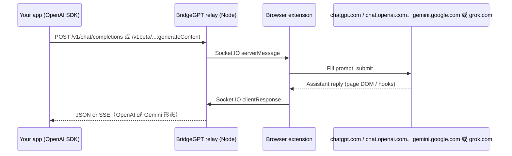

<div align="center">
  
  <h1>BridgeGPT</h1>
  <p><strong>自托管中继：通过 OpenAI / Gemini 风格的 HTTP API 驱动浏览器中的 <em>ChatGPT</em>、<em>Google Gemini</em> 或 <em>Grok</em> 网页版</strong></p>
  <p>浏览器扩展 + 小型 Node 服务。中继与浏览器都由你掌控，不依赖第三方托管桥接。</p>
</div>

**语言：** [English](README.md) | 简体中文

---

## 目录

- [能做什么](#能做什么)
- [工作原理](#工作原理)
- [功能](#功能)
- [环境要求](#环境要求)
- [快速开始](#快速开始)
- [验证安装](#验证安装)
- [部署自己的中继服务](#部署自己的中继服务)
- [服务端部署（完整文档）](docs/SERVER_DEPLOY.zh-CN.md)
- [配置](#配置)
- [HTTP API](#http-api)
- [npm 脚本](#npm-脚本)
- [生产环境建议](#生产环境建议)
- [安全](#安全)
- [局限性](#局限性)
- [故障排查](#故障排查)
- [仓库结构](#仓库结构)
- [致谢](#致谢)
- [许可证](#许可证)

---

## 能做什么

BridgeGPT 让你在自己运行的**中继（relay）**上调用 **`/v1/chat/completions`**（OpenAI 风格）以及 **`/v1beta/models/...:generateContent`**（Gemini 风格）等路由。中继把请求转给 **Chrome（或 Firefox）扩展**，扩展在已登录的 **https://chatgpt.com** / **https://chat.openai.com**、**https://gemini.google.com** 和/或 **https://grok.com** 标签页中操作页面；返回内容再包装成 JSON 或 SSE，便于沿用 **OpenAI** 或 **Gemini** 客户端的调用方式（通常只需改 **`base_url`** 与 **`api_key`**）。

**这不是**官方 OpenAI、Google Generative Language 或 xAI API，**不是** ChatGPT / Gemini / Grok 官方产品，**不能**用来规避服务条款。请仅在你有权使用的账号上、用于个人或已获许可的自动化场景。

---

## 工作原理



1. 中继通过 **`api_key`** 校验 HTTP 请求：该值与扩展「设置」里显示的密钥相同（服务端内部会把它映射到你浏览器当前的 Socket.IO 会话）。
2. 扩展按路由与请求头打开或复用 **chatgpt.com** / **chat.openai.com**、**gemini.google.com** 和/或 **grok.com** 标签页，填入用户消息并从页面读取助手回复。
3. 中继把该文本包装为 **`chat.completion`** / **`chat.completion.chunk`**，或 **Gemini `generateContent` 风格** 的 JSON。

---

## 功能

- **OpenAI 兼容** — `POST /v1/chat/completions`、`GET /v1/models`，可选 **SSE 流式**（在拿到完整回复后由中继模拟分块）。请求头 **`X-Bridge-Provider: gemini`** 时走 **gemini.google.com**；**`X-Bridge-Provider: grok`** 时走 **grok.com**（默认 ChatGPT）。
- **Gemini API 形态路由** — `GET /v1beta/models`、`POST /v1beta/models/<id>:generateContent`（及 `:streamGenerateContent`），与其它路由一样使用 **Bearer `api_key`** 鉴权。返回 JSON 为**精简版**（非与 Google 官方逐字段一致；用量为估算；对话上下文以浏览器标签页为准）。
- **自托管中继** — Express + Socket.IO；默认端口 **3456**。
- **可配置扩展** — 构建时使用 **`VITE_API_BASE_URL`** 指向你的中继（必须以 **`/`** 结尾）。
- **保活** — 断线后可按设置周期性重连 WebSocket。
- **中继首页** — 无 `api_key` 时 `GET /` 为欢迎页；带 `?api_key=<设置里的密钥>` 可打开**内置网页对话**（可选 **`&backend=gemini`** 或 **`&backend=grok`**）。可选 `&message=…` 预填首轮用户消息。`?format=json` 或 `Accept: application/json` 返回机器可读状态与示例 `chatUrl`。

---

## 环境要求

| 组件 | 版本 / 说明 |
|------|-------------|
| Node.js | **≥ 18** |
| npm | 在仓库根目录使用支持 workspaces 的安装方式 |
| 浏览器 | **Chrome** 或 **Firefox**（Manifest V3） |
| ChatGPT | 使用 ChatGPT 相关接口时：在 **https://chatgpt.com** 或 **https://chat.openai.com** 保持网页版已登录（扩展已匹配二者；其它域名如 **www** 需在 `extension/manifest.json` 中自行添加匹配规则） |
| Gemini | 使用 Gemini 相关接口或 `X-Bridge-Provider: gemini` 时：在 **https://gemini.google.com** 保持已登录 |
| Grok | 在 `/v1/chat/completions` 上使用 `X-Bridge-Provider: grok` 或中继 UI `backend=grok` 时：在 **https://grok.com** 保持已登录 |

---

## 快速开始

### 1. 克隆并安装

```bash
git clone https://github.com/ocmuuu/BridgeGPT.git
cd BridgeGPT
npm install
```

### 2. 启动中继

```bash
npm run dev:server
```

默认监听 **http://localhost:3456**。可用下面命令自检：

```bash
curl -sS http://127.0.0.1:3456/health
# {"ok":true}
```

### 3. 构建并加载扩展

**Chrome（监听模式）：**

```bash
npm run dev:chrome
```

**一次性生产构建：**

```bash
npm run build:chrome
```

然后打开 **chrome://extensions** → 开启 **开发者模式** → **加载已解压的扩展程序** → 选择 **`extension/dist_chrome/`**。

**Firefox：** 使用 `npm run dev:firefox` 或 `npm run build:firefox`，在 **`extension/dist_firefox/`** 通过 `about:debugging` 加载。

### 4. 连接并获取凭据

1. 打开扩展的 **Settings**（或首次安装时打开的页面）。
2. 点击 **Connect**，让扩展通过 WebSocket 接入中继。
3. 按你使用的后端保持 **chatgpt.com** / **chat.openai.com**、**gemini.google.com** 和/或 **grok.com** 已登录；扩展会尽量复用已有匹配标签页。
4. 在设置页复制 **`base_url`**（`…/v1`）和 **`api_key`**（形如 `sk-bridgegpt-…`）。

### 5. 调用 API（Python 示例）

```python
from openai import OpenAI

client = OpenAI(
    base_url="http://localhost:3456/v1",
    api_key="YOUR_API_KEY_FROM_EXTENSION",
)

r = client.chat.completions.create(
    model="gpt-5",
    messages=[{"role": "user", "content": "Hello"}],
)
print(r.choices[0].message.content)
```

---

## 验证安装

中继已启动、扩展已 **Connect**、对应网页已打开后，可用 **curl** 与中继 **网页对话** 做联调。

### 健康检查

```bash
curl -sS http://127.0.0.1:3456/health
# {"ok":true}
```

### ChatGPT 路径（curl）

将 `YOUR_API_KEY` 换成扩展「设置」里的密钥。

```bash
curl -sS http://127.0.0.1:3456/v1/chat/completions \
  -H "Authorization: Bearer YOUR_API_KEY" \
  -H "Content-Type: application/json" \
  -d '{"model":"gpt-5","messages":[{"role":"user","content":"用一句话打招呼。"}],"stream":false}'
```

### Grok 路径（curl，OpenAI 兼容路由）

与 ChatGPT 相同使用 **`api_key`**；增加 **`X-Bridge-Provider: grok`**，并保证 **grok.com** 可用。

```bash
curl -sS http://127.0.0.1:3456/v1/chat/completions \
  -H "Authorization: Bearer YOUR_API_KEY" \
  -H "Content-Type: application/json" \
  -H "X-Bridge-Provider: grok" \
  -d '{"model":"grok-3","messages":[{"role":"user","content":"用一句话打招呼。"}],"stream":false}'
```

**`grok-3`** 等模型名为**占位**；实际以 **grok.com** 当前会话为准。

### Gemini 路径（curl）

同样使用扩展的 **`api_key`**；请保证 **gemini.google.com** 可用（首次请求时扩展可能会自动打开标签页）。

```bash
curl -sS "http://127.0.0.1:3456/v1beta/models/gemini-3.1-flash:generateContent" \
  -H "Authorization: Bearer YOUR_API_KEY" \
  -H "Content-Type: application/json" \
  -d '{"contents":[{"role":"user","parts":[{"text":"Hello"}]}]}'
```

**`gemini-3.1-flash`** 等模型 ID 为**占位名**，实际回答以当前 Gemini 网页会话所选模型为准。

### 中继网页 UI

在浏览器打开 `http://127.0.0.1:3456/?api_key=YOUR_API_KEY`，在页面中选择 **OpenAI（ChatGPT）**、**Gemini** 或 **Grok** 后端发消息；与 `curl` 走同一套 HTTP 流程，便于快速验证。

---

## 部署自己的中继服务

**完整分步说明（构建、PM2、systemd、nginx、HTTPS、升级等）：[docs/SERVER_DEPLOY.zh-CN.md](docs/SERVER_DEPLOY.zh-CN.md)** · [English](docs/SERVER_DEPLOY.md)

在自有机器（VPS、家庭服务器等）上跑中继，可按下面步骤操作：

1. **安装** — 克隆本仓库，在仓库根目录执行 `npm install`（与 [快速开始](#快速开始) 相同）。
2. **构建** — `npm run build:server` 生成 `server/dist/`。
3. **运行** — `npm run start -w @bridgegpt/server`（或用进程管理器跑 `node server/dist/index.js`）。可设置 **`PORT`**（默认 `3456`）以及可选的 **`RELAY_REQUEST_TIMEOUT_MS`**。
4. **HTTPS** — 若客户端不在本机，请在前面加 **Caddy**、**nginx** 等反向代理并启用 TLS；须为 Socket.IO **放行 WebSocket** 升级。
5. **扩展** — 使用 **`VITE_API_BASE_URL`** 指向公网中继地址（带尾部 `/`）重新构建扩展，并把该构建安装到**长期登录 ChatGPT（chatgpt.com 或 chat.openai.com）/ Gemini / Grok（网页）的那台浏览器**里。

加固与运维细节见 [生产环境建议](#生产环境建议) 与 [安全](#安全)。更完整的生产部署清单见 **[docs/SERVER_DEPLOY.zh-CN.md](docs/SERVER_DEPLOY.zh-CN.md)**。

---

## 配置

### 中继（环境变量）

| 变量 | 默认值 | 说明 |
|------|--------|------|
| `PORT` | `3456` | HTTP 监听端口 |
| `RELAY_REQUEST_TIMEOUT_MS` | `150000` | 等待扩展返回完成的最长时间（毫秒，含冷启动标签与长回复） |

### 扩展（构建期）

| 变量 | 说明 |
|------|------|
| `VITE_API_BASE_URL` | 中继根地址，**必须带尾部斜杠**，例如 `https://relay.example.com/`。未设置时默认为 `http://127.0.0.1:3456/`。 |

示例：

```bash
VITE_API_BASE_URL=https://relay.example.com/ npm run build:chrome
```

### 对接中继时的鉴权

标准路由要求使用扩展「设置」里的 **api_key**，可通过以下方式传入：

- **`Authorization: Bearer <api_key>`**，或  
- 请求头 **`x-api-key` / `openai-api-key` / `api-key`**

旧版路径 **`/app/<api_key>/v1/...`** 把同一串密钥写在 URL 里，无需上述请求头。

---

## HTTP API

| 方法 | 路径 | 鉴权 | 说明 |
|------|------|------|------|
| GET | `/health` | 无 | 存活检查：`{ "ok": true }` |
| GET | `/connect/:api_key?socketId=...` | 无 | 扩展在 Socket.IO 连上后调用；路径中的段与 HTTP 用的 **api_key** 相同 |
| GET | `/v1/models` | Bearer / API key | 列出 `gpt-5` / `gpt-5-mini`（仅为标签；实际模型由网页会话决定） |
| GET | `/v1/models/:modelId` | Bearer / API key | 模型元数据 |
| POST | `/v1/chat/completions` | Bearer / API key | 对话补全；请求体可含 `"stream": true` 以使用 SSE。可选请求头 **`X-Bridge-Provider: gemini`** 指定 **gemini.google.com**；**`X-Bridge-Provider: grok`** 指定 **grok.com**（默认 ChatGPT）。 |
| GET | `/v1beta/models` | Bearer / API key | 列出 Gemini 形态的模型名（占位；实际模型由网页会话决定）。 |
| GET | `/v1beta/models/:modelId` | Bearer / API key | 模型元数据 |
| POST | `/v1beta/models/:resource` | Bearer / API key | `:resource` 形如 **`gemini-3.1-flash:generateContent`** 或 **`:streamGenerateContent`**，请求体为 **Google Generative Language** 风格（`contents` 等）。 |
| GET | `/` | 查询参数 `api_key` 或 Bearer | 无密钥：欢迎页 HTML。有密钥：内置网页对话；可选 **`backend=gemini`** 或 **`backend=grok`**；可选 `message` 作为首条用户消息。`format=json` 或 `Accept: application/json` 时返回 JSON |
| * | `/app/:api_key/v1/...` | 路径中的 **api_key** | 与 `/v1/...` 行为一致，供旧客户端使用 |
| * | `/app/:api_key/v1beta/...` | 路径中的 **api_key** | 与 `/v1beta/...` 一致，密钥写在路径中 |

**流式：** `stream: true` 返回 **`text/event-stream`**，行为符合 OpenAI 风格的 **`data:`** 行，并以 **`data: [DONE]`** 结束。扩展仍是一次性返回整段回复；中继再**切分**为块以兼容各 SDK。

**Gemini JSON：** 本中继返回体为**子集**，与 `generativelanguage.googleapis.com` 官方响应**不完全一致**（例如 token 为估算、缺少部分可选字段、正文来自页面 DOM）。

**未实现：** 向量嵌入、音频、图片、Assistants、Realtime、完整 Google API 等；若需要需另建服务或调整架构。

---

## npm 脚本

在**仓库根目录**执行：

| 脚本 | 作用 |
|------|------|
| `npm run dev:server` | 中继开发模式（`tsx watch`） |
| `npm run build:server` | 编译中继到 `server/dist/` |
| `npm run dev:chrome` | Chrome 扩展开发（监听） |
| `npm run dev:firefox` | Firefox 扩展开发（监听） |
| `npm run build:chrome` | 生产构建 Chrome 扩展 → `extension/dist_chrome/` |
| `npm run build:firefox` | 生产构建 Firefox 扩展 → `extension/dist_firefox/` |

**生产环境运行中继**（构建后）：

```bash
npm run build:server
npm run start -w @bridgegpt/server
# 实际执行 node server/dist/index.js
```

---

## 生产环境建议

- 若客户端不在本机，请用反向代理为中继提供 **HTTPS**。
- 扩展构建时 **`VITE_API_BASE_URL`** 必须指向该 HTTPS 源（带尾部 `/`）。
- **防火墙：** 仅向可信网络暴露中继；**`api_key` 视同密码** — 若泄露请在扩展设置中**重新生成**。
- **Socket.IO** 依赖 WebSocket；代理须支持 WebSocket 升级。

---

## 安全

- 流量包含**提示词与模型输出**；请把中继主机与 **api_key** 视为**敏感信息**。
- **不要**把真实 **api_key**、令牌或生产 URL 提交到公开仓库。
- 加固运行扩展与浏览器的机器（能调用 API 的人，在网站 UI 允许范围内可驱动你的 ChatGPT / Gemini / Grok 标签页）。

---

## 局限性

- 依赖 **ChatGPT / Gemini / Grok 网页版** 的 DOM 与交互；站点改版可能导致扩展失效，需更新扩展。
- 网页端**没有**真正的逐 token 流式输出；流式为拿到全文后由中继**模拟**。
- API 中的 **model** 多为**标签**；实际模型以当前浏览器标签页会话为准。
- **多轮对话**以浏览器里打开的会话为准，HTTP 请求体不会单独重建完整网页端历史。
- 使用本方案须遵守 **OpenAI / Google / xAI** 等服务条款及适用法律。

---

## 故障排查

| 现象 | 可检查项 |
|------|----------|
| 扩展显示 **Disconnected** | 中继是否在跑？`VITE_API_BASE_URL` 是否正确？防火墙 / HTTPS 是否一致？再点 **Connect**；需要可开启设置里的 **Keep alive**。 |
| HTTP **503**「No extension connected」 | 扩展未连接或 **api_key** 不一致。打开设置确认已 **Connect**，且客户端使用的 **api_key** 与扩展一致。 |
| HTTP **504** / 超时 | 目标标签页关闭、过慢或未渲染完；可调大 `RELAY_REQUEST_TIMEOUT_MS`；保持 **chatgpt.com** / **chat.openai.com**、**gemini.google.com** 或 **grok.com** 可正常完成回复。 |
| **扩展 reload** 后每次请求都新开标签 | Service Worker 重启后内存中的 tab 映射会丢失；若首次 `sendMessage` 因内容脚本未就绪失败，扩展会按逻辑**新建标签**。可刷新已有页面或重试第二次请求。 |
| 回复为空或异常（ChatGPT） | 站点改版后选择器可能需更新；查看对应标签页控制台。 |
| 回复为空、重复上一轮或异常（Gemini） | 确认 **gemini.google.com** 已登录；多轮场景下扩展会按**本次 prompt** 对齐会话块，若 UI 大改需同步更新 `gemini-page` 等逻辑。 |
| 回复为空或异常（Grok） | 确认 **grok.com** 已登录。扩展只采集**当前轮**助手正文（`#last-reply-container` 内 `.response-content-markdown`），不会把更早的气泡、用户消息或「思考」条当成回复；流式阶段过短的英文预览会等到正文稳定后再结束。站点改版后需更新 `grok-page` / `GrokWebProvider`。 |
| 网页端跨域 CORS | 中继对 API 使用较宽松的 CORS；若涉及浏览器 Cookie，更推荐在**服务端**调用中继。 |

---

## 仓库结构

```
bridgegpt/
├── docs/                      # 如 [SERVER_DEPLOY.zh-CN.md](docs/SERVER_DEPLOY.zh-CN.md)
├── extension/                 # Vite + CRXJS（Chrome / Firefox）
│   ├── src/pages/background/  # Service Worker、Socket.IO 客户端
│   ├── src/pages/content/     # index.tsx（内容脚本）；chatgpt-page / gemini-page / grok-page（页面世界）与 webProviders/chatgptWeb、geminiWeb、grokWeb
│   ├── src/pages/settings/    # 设置页（连接、API 地址、保活）
│   ├── manifest.json
│   └── package.json           # workspace: bridgegpt-extension
├── server/                    # 中继
│   ├── src/
│   │   ├── index.ts           # HTTP + Socket.IO 启动
│   │   ├── socket/
│   │   │   └── extensionRelay.ts  # 待处理队列、/connect、Socket.IO
│   │   ├── api/
│   │   │   ├── openai/        # /v1/*（对话、模型、SSE 等）
│   │   │   ├── gemini/        # /v1beta/* Gemini 形态路由
│   │   │   └── web/           # 各提供商网页 UI 的提示词 / 标记辅助
│   │   └── web/               # 中继首页（`GET /`）与内置对话壳
│   └── package.json           # workspace: @bridgegpt/server
├── package.json               # 工作区根
└── README.md
```

扩展子目录更多说明见 [`extension/README.md`](extension/README.md)。

---

## 致谢

本项目**借鉴了开源项目 [ApiBeam](https://github.com/NiteshSingh17/apibeam) 的思路**。若上游公共服务不可用，本仓库旨在提供**完全自托管**的方案。你在自己的文档或发行说明中提及 ApiBeam 是欢迎的，但并非强制。

技术栈参考：[Vite](https://vitejs.dev/)、[React](https://react.dev/)、[Tailwind CSS](https://tailwindcss.com/)、[Express](https://expressjs.com/)、[Socket.IO](https://socket.io/)。

---

## 许可证

[MIT](LICENSE)（若仓库中无 `LICENSE` 文件，请查看 `package.json` 的 `license` 字段）。

---

## 相关链接

- [OpenAI Python SDK](https://github.com/openai/openai-python)
- [OpenAI Node SDK](https://github.com/openai/openai-node)
- [Chrome 扩展 (MV3)](https://developer.chrome.com/docs/extensions/mv3/)
- [Socket.IO 文档](https://socket.io/docs/)
